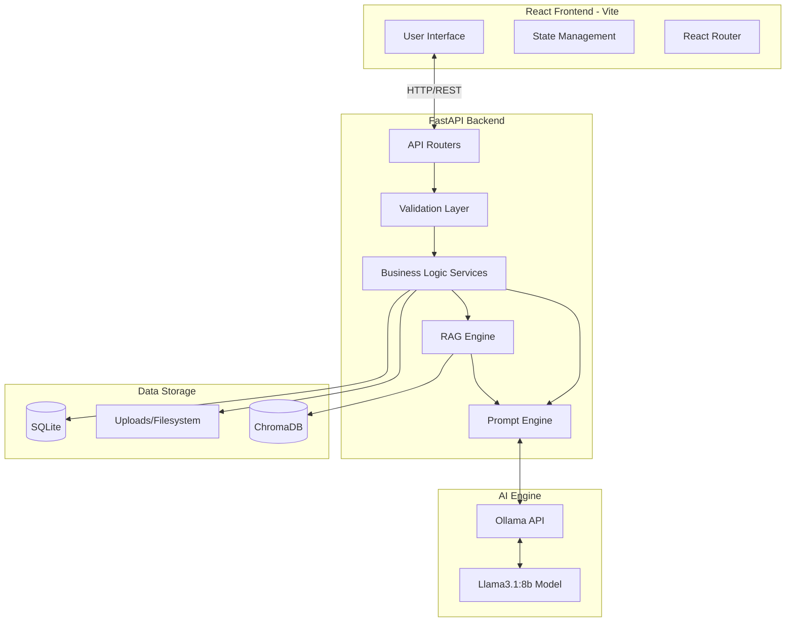

# StudyMode AI 🎓

StudyMode AI is a powerful, privacy-first, local AI-powered academic assistant designed exclusively for education. Built with a beautiful dark-mode interface, it offers a suite of study tools that leverage local LLMs via Ollama and a robust FastAPI backend.

## Features ✨

- **🎓 Academic-Only AI Chat**: An intelligent chat assistant strictly focused on educational topics.
- **📑 PDF Summarizer**: Upload academic PDFs (up to 15MB) to instantly extract text, embed it using RAG (ChromaDB), and generate concise summaries.
- **🃏 Flashcard Generator**: Instantly create interactive flashcards for any topic with customizable card counts.
- **📝 Quiz Generator**: Generate interactive quizzes (Multiple Choice, True/False, Fill in the Blanks) with varying difficulty levels (Easy to Expert) and automated grading with explanations.
- **🧠 Smart Notes**: Paste your rough, unstructured thoughts and watch the AI stream them into beautifully formatted Markdown study notes.
- **🕒 Unified History (Recents)**: Every quiz, flashcard set, note, chat, and PDF is persistently saved to a local SQLite database. A unified "Recents" sidebar allows you to instantly restore previous sessions.
- **🛑 Instant Cancellation**: Deeply integrated `AbortController` pipeline across the network layer allows you to stop any AI generation instantly using a UI button or the `Ctrl+D` shortcut.
- **🌍 Multi-Language Support**: Fully custom, lightweight internationalization engine supporting English, Telugu (తెలుగు), and Hindi (हिन्दी) across the entire UI.
- **🌙 Dark Mode Default**: A premium, visually stunning dark mode UI built with TailwindCSS.

## Tech Stack 🛠️

### Frontend
- **React.js** (via Vite)
- **TailwindCSS** for styling
- **Lucide React** for beautiful iconography
- **Framer Motion** for micro-animations
- **Axios & Fetch API** with AbortController for network requests

### Backend
- **FastAPI** (Python) for a blazing fast API
- **SQLAlchemy & SQLite** for persistent storage
- **ChromaDB** for vector embeddings and RAG (Retrieval-Augmented Generation)
- **Ollama** for running local, private Large Language Models (LLMs)

## Getting Started 🚀

### Prerequisites
1. **Node.js** (v18+ recommended)
2. **Python** (v3.9+ recommended)
3. **Ollama**: You must have [Ollama](https://ollama.com/) installed and running locally.
   - Pull your preferred model (e.g., `ollama run llama3` or `ollama run mistral`). Ensure the backend `OllamaClient` points to the correct model name.

### Installation

#### 1. Clone the repository
```bash
git clone <your-repo-url>
cd "Studymode Ai"
```

#### 2. Setup the Backend
Navigate to the backend directory and install the Python dependencies:
```bash
cd backend
python -m venv venv
# On Windows:
venv\Scripts\activate
# On Mac/Linux:
# source venv/bin/activate

pip install -r requirements.txt
```

Run the FastAPI server:
```bash
uvicorn api.main:app --reload --port 8000
```
*The backend will automatically create the SQLite database (`studymode.db`) and ChromaDB storage directory on startup.*

#### 3. Setup the Frontend
Open a new terminal, navigate to the frontend directory, and install dependencies:
```bash
cd frontend
npm install
```

Start the Vite development server:
```bash
npm run dev
```

### Usage
Once both servers are running, open your browser and navigate to `http://localhost:5173`. 
- Try asking a question in the **AI Chat**.
- Generate a test in **Quiz Generator**.
- If a generation takes too long, hit the red **Stop** button or press `Ctrl+D`.
- Use the profile dropdown in the top right to switch between English, Telugu, and Hindi.

## Architecture Highlights 🏗️
- **Streaming Responses**: The backend utilizes Server-Sent Events (SSE) to stream text directly from Ollama to the React frontend in real-time, giving a fluid user experience.
- **Custom Translation Engine**: Instead of relying on bloated libraries like `react-i18next`, StudyMode uses a custom React Context (`LanguageContext`) mapping to lightweight JSON dictionaries.
- **Persistent DB Restoration**: Every generated asset has its own ID (`?id=X`). The frontend `useEffect` hooks automatically detect this ID on mount and pull the full context from the SQLite database.

## Overall System Architecture 📐

StudyMode AI is a local-first, offline AI application. The system follows a client-server architecture with a dedicated AI and vector database layer.



## License 📄
This project is open-source and available under the MIT License.
